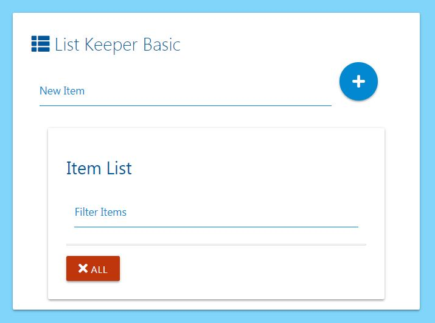
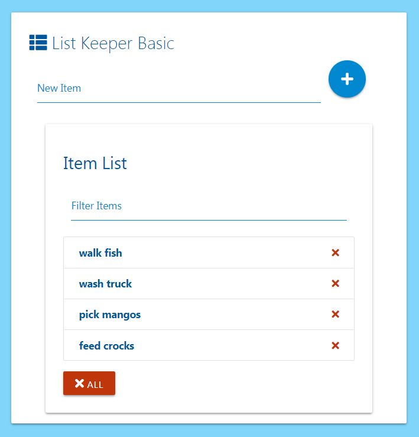
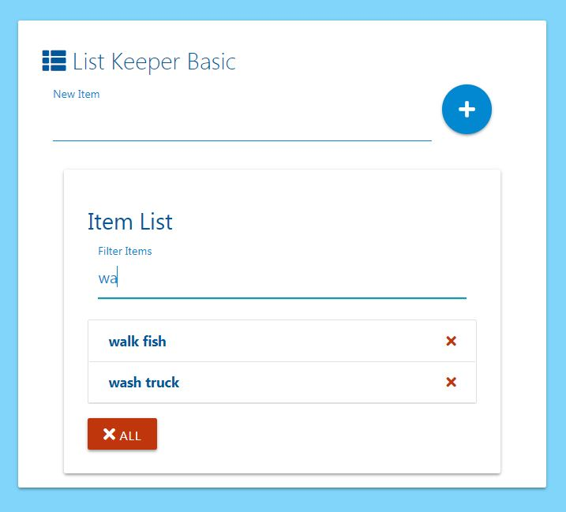
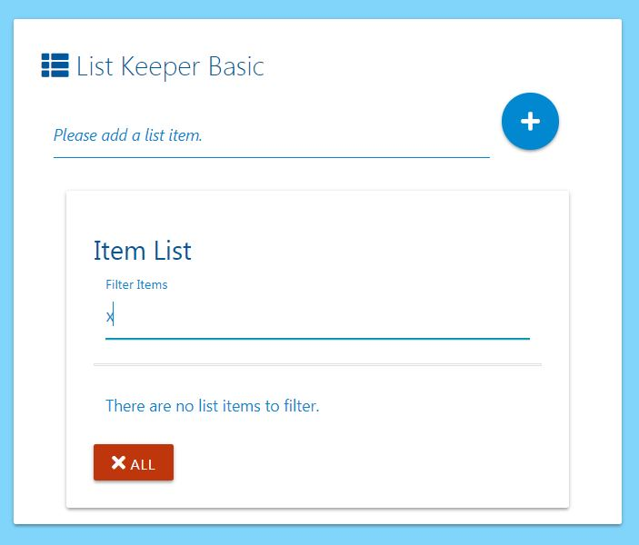

# listKeeperBasic

 *listKeeperBasic* is a list app created under the direction of [Brad Traversy](https://www.udemy.com/modern-javascript-from-the-beginning/) in his *Modern JavaScript from the Beginning* course. The app uses the following technologies:

  * JavaScript
  * HTML
  * CSS
  * Materialize-css

### New Items

When new items are added to the list, they are added to the DOM and and persist via `.localStorage` using JavaScript. Items can be deleted on an individual basis from the DOM/`.localStorage`, or the entire list can be emptied at once. Both possibilities are accompanied by a `confirm()` message.

### Filter List

List items can be filtered, where only matching items populate the list.

### Prompts and Error Handling

*listKeeperBasic* prevents an empty population items, marked by a prompt in the `New Item` field. A prompt likewise accompanies any attempt to filter a non-existent list.

